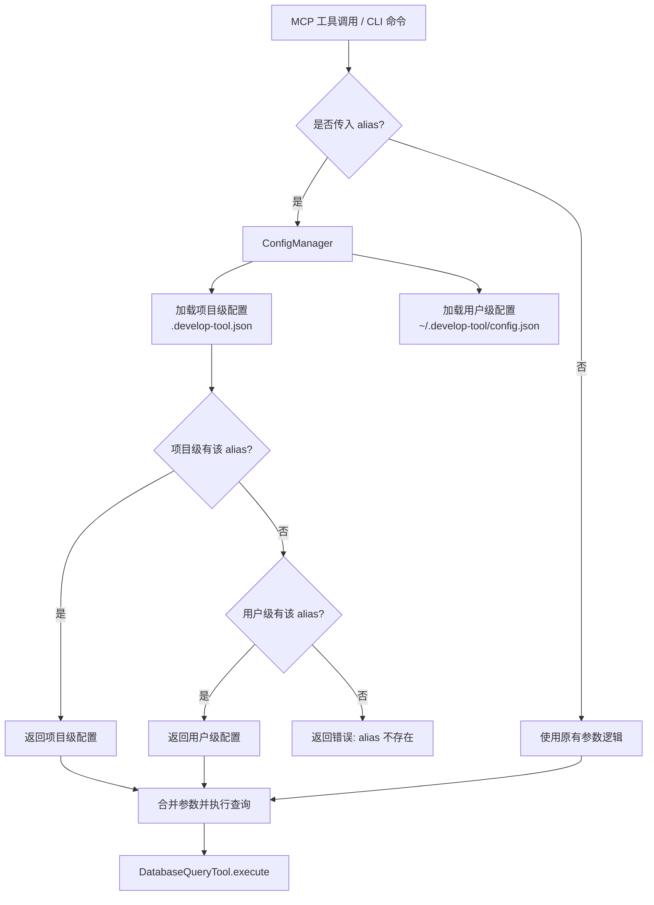
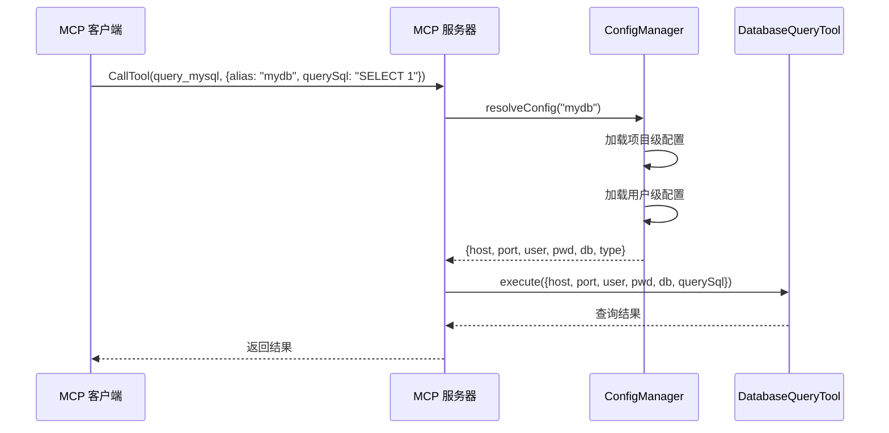
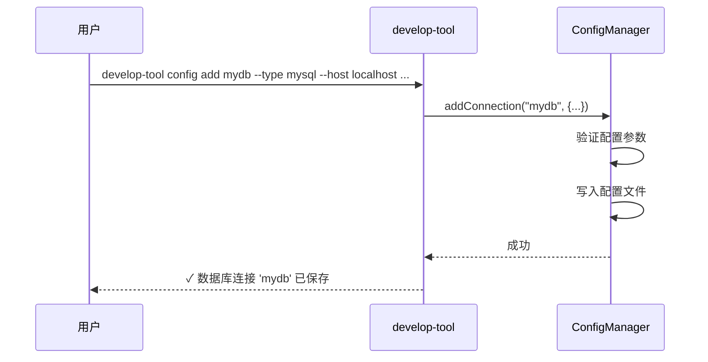

# 设计文档: 数据库别名配置 (database-alias-config)

## 概述

为 `@xuejike/develop-tool` 项目添加用户级配置文件功能，允许用户预先存储多个数据库连接配置，每个配置通过唯一别名（alias）标识。用户在使用 MCP 工具或 CLI 查询时，可以通过别名直接引用数据库连接，避免每次都传递完整的 host、port、user、pwd、db 等参数。

配置文件采用 JSON 格式存储在用户主目录 `~/.develop-tool/config.json`，同时支持项目级配置文件 `.develop-tool.json`（项目根目录）。项目级配置优先于用户级配置，实现灵活的配置覆盖机制。

## 架构



## 序列图

### MCP 工具通过别名查询



### CLI 管理配置



## 组件与接口

### 组件 1: ConfigManager

**职责**: 配置文件的加载、解析、验证、持久化管理

```javascript
/**
 * 数据库别名配置管理器
 * 负责配置文件的读写和别名解析
 */
class ConfigManager {
  /**
   * @param {Object} options - 配置选项
   * @param {string} [options.userConfigPath] - 用户级配置文件路径（默认 ~/.develop-tool/config.json）
   * @param {string} [options.projectConfigPath] - 项目级配置文件路径（默认 .develop-tool.json）
   */
  constructor(options = {})

  /**
   * 通过别名解析数据库连接配置
   * @param {string} alias - 数据库别名
   * @returns {DatabaseConnectionConfig} 数据库连接配置
   * @throws {Error} 别名不存在时抛出错误
   */
  resolveAlias(alias)

  /**
   * 添加数据库连接配置
   * @param {string} alias - 别名
   * @param {DatabaseConnectionConfig} config - 连接配置
   * @param {Object} [options] - 选项
   * @param {boolean} [options.global=true] - 是否保存到用户级配置（false 则保存到项目级）
   */
  addConnection(alias, config, options = {})

  /**
   * 删除数据库连接配置
   * @param {string} alias - 别名
   * @param {Object} [options] - 选项
   * @param {boolean} [options.global=true] - 是否从用户级配置删除
   */
  removeConnection(alias, options = {})

  /**
   * 列出所有已配置的别名
   * @returns {Array<{alias: string, type: string, host: string, db: string, source: string}>}
   */
  listConnections()

  /**
   * 验证别名是否存在
   * @param {string} alias - 别名
   * @returns {boolean}
   */
  hasAlias(alias)
}
```

**职责清单**:
- 管理用户级和项目级两层配置文件
- 提供别名到完整连接参数的解析
- 配置的 CRUD 操作
- 配置参数的合法性验证

### 组件 2: MCP 工具定义扩展

**职责**: 在现有工具的 inputSchema 中增加 `alias` 可选参数，调整 `required` 字段使连接参数在有 alias 时变为可选

```javascript
// mcp.full.config.js 中工具定义的变更
{
  inputSchema: {
    type: "object",
    properties: {
      alias: {
        type: "string",
        description: "数据库连接别名，使用预配置的连接信息。指定 alias 后无需传递 host/port/user/pwd/db"
      },
      host: { type: "string", description: "数据库主机地址" },
      port: { type: "integer", description: "数据库端口" },
      user: { type: "string", description: "数据库用户名" },
      pwd: { type: "string", description: "数据库密码" },
      db: { type: "string", description: "数据库名称" },
      querySql: { type: "string", description: "要执行的SQL查询语句（仅支持SELECT等只读操作）" }
    },
    required: ["querySql"]  // 仅 querySql 为必填，连接信息可通过 alias 提供
  }
}
```

### 组件 3: CLI 配置子命令扩展

**职责**: 在 `develop-tool` 命令行工具中增加配置管理命令

```javascript
// 新增 CLI 子命令
// develop-tool config add <alias> --type mysql --host ... --port ... --user ... --password ... --database ...
// develop-tool config remove <alias>
// develop-tool config list
// develop-tool config show <alias>
```

## 数据模型

### DatabaseConnectionConfig

```javascript
/**
 * 数据库连接配置
 * @typedef {Object} DatabaseConnectionConfig
 * @property {string} type - 数据库类型 (mysql | postgresql | oracle | mssql)
 * @property {string} host - 主机地址
 * @property {number} port - 端口
 * @property {string} user - 用户名
 * @property {string} pwd - 密码
 * @property {string} db - 数据库名称
 */
```

### 配置文件格式 (config.json)

```javascript
/**
 * 配置文件结构
 * 存储路径: ~/.develop-tool/config.json 或 .develop-tool.json
 */
const configFileSchema = {
  // 配置文件版本号，便于后续迁移
  version: "1.0",
  // 数据库连接别名映射
  connections: {
    // key 为别名，value 为连接配置
    "my-local-mysql": {
      type: "mysql",
      host: "localhost",
      port: 3306,
      user: "root",
      pwd: "password",
      db: "myapp"
    },
    "prod-pg": {
      type: "postgresql",
      host: "db.example.com",
      port: 5432,
      user: "readonly",
      pwd: "secret",
      db: "production"
    }
  }
};
```

### 别名验证规则

```javascript
/**
 * 别名命名规则
 * - 长度: 1-64 字符
 * - 允许字符: 字母、数字、连字符(-)、下划线(_)、点(.)
 * - 不能以连字符或点开头
 * - 大小写不敏感（存储时统一转为小写）
 */
const ALIAS_PATTERN = /^[a-zA-Z_][a-zA-Z0-9\-_.]{0,63}$/;
```

## 算法伪代码与形式规格

### 别名解析算法

```javascript
/**
 * 解析工具调用参数，支持 alias 和直接参数两种模式
 * @param {Object} args - 工具调用传入的参数
 * @returns {Object} 完整的数据库连接配置 + querySql
 */
function resolveToolArguments(args) {
  const { alias, querySql, ...directParams } = args;

  // 情况1: 未传 alias，使用直接参数（向后兼容）
  if (!alias) {
    // 验证直接参数完整性
    const required = ['host', 'port', 'user', 'pwd', 'db'];
    for (const field of required) {
      if (!directParams[field]) {
        throw new Error(`缺少必填参数: ${field}（未指定 alias 时需要提供完整连接信息）`);
      }
    }
    return { ...directParams, querySql };
  }

  // 情况2: 传入 alias，从配置文件解析
  const configManager = new ConfigManager();
  const aliasConfig = configManager.resolveAlias(alias);

  // 直接参数可以覆盖 alias 配置中的字段（局部覆盖）
  const merged = {
    ...aliasConfig,
    ...Object.fromEntries(
      Object.entries(directParams).filter(([_, v]) => v !== undefined && v !== null)
    ),
    querySql
  };

  return merged;
}
```

**前置条件:**
- `args` 非空且至少包含 `querySql`
- 若 `alias` 存在，则配置文件可访问

**后置条件:**
- 返回值包含完整的 `{host, port, user, pwd, db, querySql}` 字段
- 若 `alias` 不存在于配置中，抛出明确错误信息
- 直接传入的参数优先级高于 alias 配置

**循环不变量:** 不适用

---

### 配置文件加载算法

```javascript
/**
 * 加载并合并多层配置
 * 优先级: 项目级 > 用户级
 */
function loadMergedConfig() {
  const userConfig = loadConfigFile(getUserConfigPath());
  const projectConfig = loadConfigFile(getProjectConfigPath());

  // 合并连接配置，项目级覆盖用户级
  const merged = {
    connections: {
      ...(userConfig?.connections || {}),
      ...(projectConfig?.connections || {})
    }
  };

  return merged;
}

/**
 * 安全加载配置文件
 * @param {string} filePath - 配置文件路径
 * @returns {Object|null} 配置对象，文件不存在则返回 null
 */
function loadConfigFile(filePath) {
  // 文件不存在返回 null（非错误状态）
  if (!fs.existsSync(filePath)) {
    return null;
  }

  const content = fs.readFileSync(filePath, 'utf-8');
  const config = JSON.parse(content);

  // 验证配置文件格式
  validateConfigSchema(config);

  return config;
}
```

**前置条件:**
- 文件系统可访问
- 若文件存在，内容为合法 JSON

**后置条件:**
- 返回的合并配置包含两层配置中所有 alias
- 同名 alias 以项目级为准
- 文件不存在时不抛错，返回空配置

---

### 添加连接配置算法

```javascript
/**
 * 添加或更新数据库连接配置
 * @param {string} alias - 别名
 * @param {DatabaseConnectionConfig} connectionConfig - 连接配置
 * @param {boolean} global - 是否存到用户级配置
 */
function addConnection(alias, connectionConfig, global = true) {
  // 1. 验证别名格式
  if (!ALIAS_PATTERN.test(alias)) {
    throw new Error(`无效的别名格式: "${alias}"。别名只能包含字母、数字、连字符、下划线和点，且不能以连字符或点开头`);
  }

  // 2. 验证连接配置完整性
  const requiredFields = ['type', 'host', 'port', 'user', 'pwd', 'db'];
  for (const field of requiredFields) {
    if (!connectionConfig[field]) {
      throw new Error(`缺少必填配置字段: ${field}`);
    }
  }

  // 3. 验证数据库类型
  const validTypes = ['mysql', 'postgresql', 'oracle', 'mssql'];
  if (!validTypes.includes(connectionConfig.type)) {
    throw new Error(`不支持的数据库类型: ${connectionConfig.type}`);
  }

  // 4. 确定配置文件路径
  const configPath = global ? getUserConfigPath() : getProjectConfigPath();

  // 5. 加载现有配置（或创建新配置）
  let config = loadConfigFile(configPath) || { version: "1.0", connections: {} };

  // 6. 写入新的连接配置
  config.connections[alias.toLowerCase()] = connectionConfig;

  // 7. 确保目录存在并保存文件
  ensureDir(path.dirname(configPath));
  fs.writeFileSync(configPath, JSON.stringify(config, null, 2), 'utf-8');
}
```

**前置条件:**
- `alias` 符合命名规则
- `connectionConfig` 包含所有必填字段
- 文件系统具有写入权限

**后置条件:**
- 配置文件包含新增/更新的连接配置
- 别名统一存储为小写
- 原有其他配置不受影响

## 示例用法

```javascript
// === 示例1: MCP 工具调用 - 使用别名 ===
// 用户只需传 alias 和 querySql
const toolCallArgs = {
  alias: "my-local-mysql",
  querySql: "SELECT * FROM users LIMIT 10"
};

// === 示例2: MCP 工具调用 - 使用别名 + 覆盖部分参数 ===
// alias 提供基础配置，但切换到另一个数据库
const toolCallArgs2 = {
  alias: "my-local-mysql",
  db: "another_db",           // 覆盖 alias 中的 db
  querySql: "SELECT * FROM orders"
};

// === 示例3: MCP 工具调用 - 不使用别名（向后兼容）===
const toolCallArgs3 = {
  host: "localhost",
  port: 3306,
  user: "root",
  pwd: "password",
  db: "myapp",
  querySql: "SELECT 1"
};

// === 示例4: CLI 管理配置 ===
// 添加连接
// $ db-query-mcp config add my-local-mysql --type mysql --host localhost --port 3306 --user root --password pass --database myapp

// 列出所有连接
// $ db-query-mcp config list

// 使用别名查询
// $ db-query-mcp query --alias my-local-mysql -q "SELECT * FROM users"

// 删除连接
// $ db-query-mcp config remove my-local-mysql
```

## 正确性属性

*属性是系统在所有有效执行中都应保持为真的特征或行为——本质上是对系统应做什么的形式化陈述。属性是人类可读规范与机器可验证正确性保证之间的桥梁。*

### Property 1: 添加-解析往返一致性

*For any* 合法别名和有效的连接配置，通过 addConnection 添加后，再通过 resolveAlias 解析，应返回与原始配置等价的连接信息（密码经加密再解密后一致）。

**Validates: Requirements 1.1, 4.1, 4.7**

### Property 2: 向后兼容 - 无 alias 时参数透传

*For any* 不包含 alias 的完整工具调用参数（含 host、port、user、pwd、db、querySql），resolveToolArguments 应原样返回所有连接参数，行为与未引入别名功能前一致。

**Validates: Requirements 3.1, 9.3**

### Property 3: 配置覆盖优先级

*For any* 同时存在于项目级和用户级配置中的同名 alias，resolveAlias 返回的配置应等于项目级配置中的值。

**Validates: Requirements 2.1, 2.2, 2.3, 2.4**

### Property 4: 直接参数覆盖 alias 配置

*For any* alias 配置和任意非空的直接覆盖参数子集，resolveToolArguments 的结果中，被覆盖的字段应使用直接参数值，未覆盖的字段应保持 alias 配置值。

**Validates: Requirement 1.3**

### Property 5: 别名大小写不敏感

*For any* 已配置的别名，使用该别名的任意大小写变体调用 resolveAlias，应返回相同的配置结果。

**Validates: Requirement 1.4**

### Property 6: 删除后不可解析

*For any* 已存在的别名，执行 removeConnection 后，hasAlias 应返回 false，resolveAlias 应抛出错误。

**Validates: Requirements 5.1, 5.2**

### Property 7: 非法别名被拒绝

*For any* 不符合 ALIAS_PATTERN（`/^[a-zA-Z_][a-zA-Z0-9\-_.]{0,63}$/`）的字符串，addConnection 应拒绝并抛出格式错误。

**Validates: Requirement 4.2**

### Property 8: 密码加密往返一致性

*For any* 字符串作为密码，decryptPassword(encryptPassword(pwd)) 应等于原始密码。

**Validates: Requirements 6.1, 6.2**

### Property 9: 加密后不含明文

*For any* 长度大于 0 的密码字符串，encryptPassword 的输出不应包含原始密码的明文内容。

**Validates: Requirement 6.6**

### Property 10: 明文密码兼容

*For any* 不以 `enc:v1:` 开头的字符串，decryptPassword 应原样返回该字符串。

**Validates: Requirement 6.4**

### Property 11: 不存在的别名报错

*For any* 不存在于任何配置文件中的别名字符串，resolveAlias 应抛出包含错误信息的异常。

**Validates: Requirements 1.2, 10.1**

### Property 12: 缺少参数时的错误检测

*For any* 不包含 alias 且缺少至少一个必填连接字段的参数对象，resolveToolArguments 应抛出包含缺少字段名称的错误。

**Validates: Requirement 3.2**

### Property 13: 配置文件格式完整性

*For any* 通过 ConfigManager 写入的配置文件，其 JSON 内容应包含 `version` 和 `connections` 两个顶级字段。

**Validates: Requirement 7.1**

### Property 14: listConnections 包含所有已添加的别名

*For any* 通过 addConnection 添加的别名集合，listConnections 返回的别名列表应包含所有已添加的别名。

**Validates: Requirement 5.3**

## 错误处理

### 错误场景 1: 别名不存在

**条件**: 用户传入的 alias 在任何配置文件中都找不到
**响应**: 返回明确错误信息，列出可用的别名
**恢复**: 提示用户使用 `config list` 查看可用别名，或使用 `config add` 添加

### 错误场景 2: 配置文件格式错误

**条件**: 配置文件内容不是合法 JSON 或不符合 schema
**响应**: 输出解析错误详情和文件路径
**恢复**: 提示用户检查配置文件格式，或使用 CLI 重新添加配置

### 错误场景 3: 文件系统权限不足

**条件**: 无法读取或写入配置文件
**响应**: 返回权限错误，指出具体文件路径
**恢复**: 提示用户检查文件权限

### 错误场景 4: alias 和直接参数都不完整

**条件**: 未传 alias，且直接参数缺少必填字段
**响应**: 返回缺少字段列表，提示两种使用方式
**恢复**: 用户补充缺少参数或使用 alias

### 错误场景 5: 数据库类型不匹配

**条件**: 用户调用 `query_mysql` 工具但 alias 配置的 type 为 `postgresql`
**响应**: 输出警告信息，但仍以工具类型为准执行（工具名决定数据库类型）
**恢复**: 无需恢复，行为明确

## 测试策略

### 单元测试

- ConfigManager 的 CRUD 操作
- 别名解析逻辑（单层、多层配置合并）
- 参数合并与覆盖逻辑
- 别名格式验证
- 配置文件 schema 验证
- 边界情况：空配置文件、空 connections 对象

### 属性测试

**测试库**: fast-check

- 任意合法别名经 addConnection → resolveAlias 后能正确返回原配置
- 任意非法别名格式被 addConnection 拒绝
- 配置文件的序列化/反序列化幂等性

### 集成测试

- MCP 工具调用时 alias 参数的端到端流程
- CLI config 子命令的完整工作流
- 多配置文件合并的优先级验证
- 向后兼容性：不使用 alias 时行为不变

## 安全考虑

### 密码加密存储

配置文件中的密码不以明文存储，采用 Node.js 内置 `crypto` 模块的 AES-256-GCM 对称加密方案：

**加密方案设计:**

```javascript
const crypto = require('crypto');

/**
 * 加密密钥派生
 * 使用机器标识 + 用户名作为种子，通过 PBKDF2 派生 256 位密钥
 * 这不是为了抵抗高级攻击者（密钥材料在本机可获取），
 * 而是防止配置文件被意外泄露（如误提交到 git）时密码直接暴露
 */
const SALT = 'coding-db-mcp-v1';  // 固定盐值，保证同一机器同一用户每次派生相同密钥

function deriveKey() {
  const os = require('os');
  // 使用用户主目录 + 用户名作为密钥种子（本机唯一）
  const seed = `${os.homedir()}:${os.userInfo().username}`;
  return crypto.pbkdf2Sync(seed, SALT, 100000, 32, 'sha256');
}

/**
 * 加密密码
 * @param {string} plaintext - 明文密码
 * @returns {string} 加密后的字符串，格式: "enc:v1:<iv_hex>:<authTag_hex>:<ciphertext_hex>"
 */
function encryptPassword(plaintext) {
  const key = deriveKey();
  const iv = crypto.randomBytes(12);  // GCM 推荐 12 字节 IV
  const cipher = crypto.createCipheriv('aes-256-gcm', key, iv);
  
  let encrypted = cipher.update(plaintext, 'utf8', 'hex');
  encrypted += cipher.final('hex');
  const authTag = cipher.getAuthTag().toString('hex');
  
  return `enc:v1:${iv.toString('hex')}:${authTag}:${encrypted}`;
}

/**
 * 解密密码
 * @param {string} encryptedStr - 加密字符串
 * @returns {string} 明文密码
 */
function decryptPassword(encryptedStr) {
  // 兼容明文密码（未加密的旧配置）
  if (!encryptedStr.startsWith('enc:v1:')) {
    return encryptedStr;
  }
  
  const [, , ivHex, authTagHex, cipherHex] = encryptedStr.split(':');
  const key = deriveKey();
  const decipher = crypto.createDecipheriv('aes-256-gcm', key, Buffer.from(ivHex, 'hex'));
  decipher.setAuthTag(Buffer.from(authTagHex, 'hex'));
  
  let decrypted = decipher.update(cipherHex, 'hex', 'utf8');
  decrypted += decipher.final('utf8');
  return decrypted;
}
```

**配置文件中密码的存储格式:**

```json
{
  "version": "1.0",
  "connections": {
    "my-local-mysql": {
      "type": "mysql",
      "host": "localhost",
      "port": 3306,
      "user": "root",
      "pwd": "enc:v1:a1b2c3d4e5f6a1b2c3d4e5f6:f1e2d3c4b5a6f1e2d3c4b5a6f1e2d3c4:9f8e7d6c5b4a",
      "db": "myapp"
    }
  }
}
```

**设计要点:**
- 加密前缀 `enc:v1:` 标识该字段已加密，便于向后兼容（无前缀视为明文）
- 使用 AES-256-GCM 提供加密 + 完整性校验
- 密钥通过本机信息派生，配置文件即使泄露到其他机器也无法解密
- `addConnection` 时自动加密密码字段，`resolveAlias` 时自动解密
- 版本号 `v1` 便于未来升级加密算法时做迁移

**ConfigManager 中的集成:**

```javascript
class ConfigManager {
  /**
   * 添加连接时自动加密密码
   */
  addConnection(alias, config, options = {}) {
    const encryptedConfig = {
      ...config,
      pwd: encryptPassword(config.pwd)
    };
    // ... 写入配置文件
  }

  /**
   * 解析别名时自动解密密码
   */
  resolveAlias(alias) {
    const config = this._getRawConfig(alias);
    return {
      ...config,
      pwd: decryptPassword(config.pwd)
    };
  }
}
```

### 其他安全措施

- 配置文件权限设为 `0600`（仅所有者可读写）
- 创建用户级配置目录时设置 `0700` 权限
- CLI 添加密码时支持 `--password-stdin` 从标准输入读取，避免命令行历史记录泄露
- 项目级配置文件 `.db-mcp.json` 应建议用户添加到 `.gitignore`
- `config list` / `config show` 命令展示密码时显示为 `****`，不输出明文

## 依赖

- `fs` / `path` / `os` / `crypto` - Node.js 内置模块，用于文件操作、路径处理和密码加密
- 无需引入额外第三方依赖
