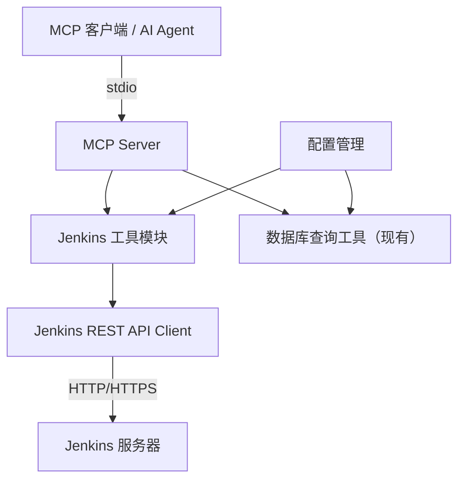
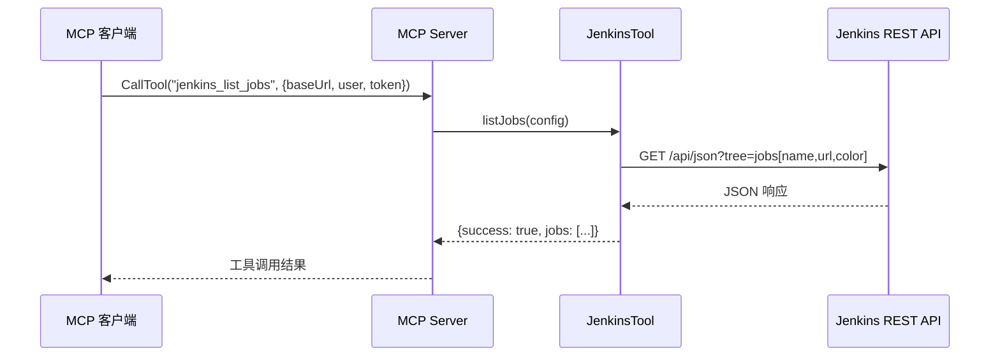
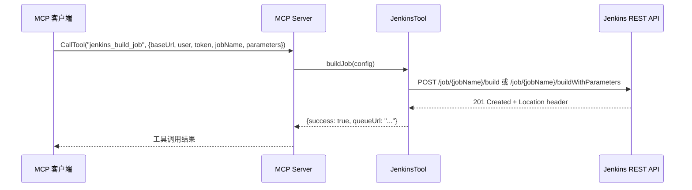
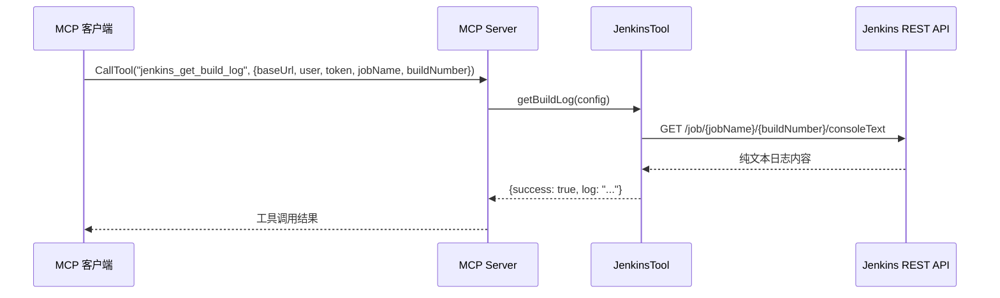

# 设计文档: Jenkins 集成

## 概述

为现有 MCP 数据库查询工具项目新增 Jenkins CI/CD 集成功能。该功能允许 AI Agent 通过 MCP 协议与 Jenkins 服务器交互，支持三个核心操作：查看所有 Jenkins Job 列表、启动 Jenkins Job 构建、查看 Jenkins 构建日志。

Jenkins 集成遵循现有项目的工具注册模式，通过 Jenkins REST API 与 Jenkins 服务器通信。连接配置支持环境变量和别名两种方式，与现有数据库工具的配置模式保持一致。

## 架构



## 时序图

### 查看 Jenkins Job 列表



### 启动 Jenkins Job



### 查看构建日志



## 组件与接口

### 组件 1: JenkinsTool

**职责**: Jenkins 操作的核心工具类，封装所有 Jenkins API 交互逻辑。

```javascript
/**
 * Jenkins 工具类接口定义
 */
class JenkinsTool {
  /**
   * 获取所有 Jenkins Job 列表
   * @param {JenkinsConfig} config - Jenkins 连接配置
   * @returns {Promise<ToolResult>} Job 列表结果
   */
  async listJobs(config) {}

  /**
   * 启动 Jenkins Job 构建
   * @param {BuildConfig} config - 构建配置（含 Job 名称和参数）
   * @returns {Promise<ToolResult>} 构建触发结果
   */
  async buildJob(config) {}

  /**
   * 获取 Jenkins 构建日志
   * @param {LogConfig} config - 日志查询配置
   * @returns {Promise<ToolResult>} 构建日志内容
   */
  async getBuildLog(config) {}
}
```

**职责清单**:
- 封装 Jenkins REST API 调用
- 处理认证（Basic Auth: user + API token）
- 统一错误处理和响应格式
- 支持别名配置解析

### 组件 2: Jenkins 配置扩展（mcp.full.config.js）

**职责**: 在现有 MCP 配置中注册 Jenkins 相关工具定义。

```javascript
// Jenkins 工具定义结构
const jenkinsTools = {
  jenkins_list_jobs: {
    name: "jenkins_list_jobs",
    description: "获取 Jenkins 所有 Job 列表",
    inputSchema: { /* ... */ }
  },
  jenkins_build_job: {
    name: "jenkins_build_job",
    description: "启动 Jenkins Job 构建",
    inputSchema: { /* ... */ }
  },
  jenkins_get_build_log: {
    name: "jenkins_get_build_log",
    description: "获取 Jenkins 构建日志",
    inputSchema: { /* ... */ }
  }
};
```

## 数据模型

### JenkinsConfig（连接配置）

```javascript
/**
 * @typedef {Object} JenkinsConfig
 * @property {string} [alias] - Jenkins 连接别名（可选，指定后其他参数可省略）
 * @property {string} baseUrl - Jenkins 服务器地址，如 http://jenkins.example.com:8080
 * @property {string} user - Jenkins 用户名
 * @property {string} token - Jenkins API Token
 */
```

**校验规则**:
- `baseUrl` 必须是合法 URL（http/https 开头）
- `user` 非空字符串
- `token` 非空字符串
- 如果指定 `alias`，则从配置文件解析连接参数

### BuildConfig（构建配置）

```javascript
/**
 * @typedef {Object} BuildConfig
 * @property {string} [alias] - Jenkins 连接别名
 * @property {string} baseUrl - Jenkins 服务器地址
 * @property {string} user - Jenkins 用户名
 * @property {string} token - Jenkins API Token
 * @property {string} jobName - 要构建的 Job 名称
 * @property {Object} [parameters] - 构建参数（参数化 Job 时使用）
 */
```

**校验规则**:
- 继承 JenkinsConfig 所有校验规则
- `jobName` 非空字符串
- `parameters` 为可选对象，键值对形式

### LogConfig（日志查询配置）

```javascript
/**
 * @typedef {Object} LogConfig
 * @property {string} [alias] - Jenkins 连接别名
 * @property {string} baseUrl - Jenkins 服务器地址
 * @property {string} user - Jenkins 用户名
 * @property {string} token - Jenkins API Token
 * @property {string} jobName - Job 名称
 * @property {number|string} [buildNumber="lastBuild"] - 构建号，默认最新构建
 */
```

**校验规则**:
- 继承 JenkinsConfig 所有校验规则
- `jobName` 非空字符串
- `buildNumber` 为正整数或 "lastBuild" 字符串

### ToolResult（统一响应）

```javascript
/**
 * @typedef {Object} ToolResult
 * @property {boolean} success - 操作是否成功
 * @property {*} [data] - 成功时的数据
 * @property {string} [error] - 失败时的错误信息
 * @property {string} [code] - 错误代码
 */
```


## 正确性属性

*属性是系统在所有有效执行中应当保持为真的特征或行为——本质上是关于系统应该做什么的形式化陈述。属性作为人类可读规格与机器可验证正确性保证之间的桥梁。*

### 属性 1: Job 列表返回完整字段

*对于任意* Jenkins API 返回的 Job 数据，Jenkins_Tool 的 listJobs 返回结果中每个 Job 都应包含 name、url 和 color（状态）字段。

**验证: 需求 1.1**

### 属性 2: 别名解析正确性

*对于任意* 有效的别名配置映射，当通过别名调用 Jenkins 工具时，实际使用的连接参数应与别名对应的配置完全一致，且优先于手动输入的参数。

**验证: 需求 1.2, 4.4**

### 属性 3: 构建参数路由选择

*对于任意* 构建请求，当 parameters 非空时应调用 buildWithParameters 接口，当 parameters 为空或未定义时应调用 build 接口。

**验证: 需求 2.2, 2.3**

### 属性 4: 构建日志完整性

*对于任意* Jenkins API 返回的日志文本，Jenkins_Tool 的 getBuildLog 返回的 log 字段应与原始 API 响应内容完全一致，不丢失不截断。

**验证: 需求 3.1**

### 属性 5: URL 格式校验

*对于任意* 非合法 HTTP/HTTPS URL 的 baseUrl 字符串，Jenkins_Tool 应拒绝请求并返回错误响应，不发起网络调用。

**验证: 需求 4.1**

### 属性 6: 空参数校验

*对于任意* user 或 token 为空字符串或纯空白字符的请求，Jenkins_Tool 应拒绝请求并返回参数缺失的错误响应。

**验证: 需求 4.2**

### 属性 7: 成功响应格式一致性

*对于任意* 成功的 Jenkins 操作，返回结果必须包含 `success: true` 和 `data` 字段。

**验证: 需求 6.1**

### 属性 8: 失败响应格式一致性

*对于任意* 失败的 Jenkins 操作，返回结果必须包含 `success: false`、`error` 和 `code` 字段。

**验证: 需求 6.2**

### 属性 9: 响应 JSON 序列化

*对于任意* Jenkins 工具的操作响应，MCP 返回的 content 类型为 "text"，且 text 内容可被 JSON.parse 成功解析为有效对象。

**验证: 需求 6.3**
