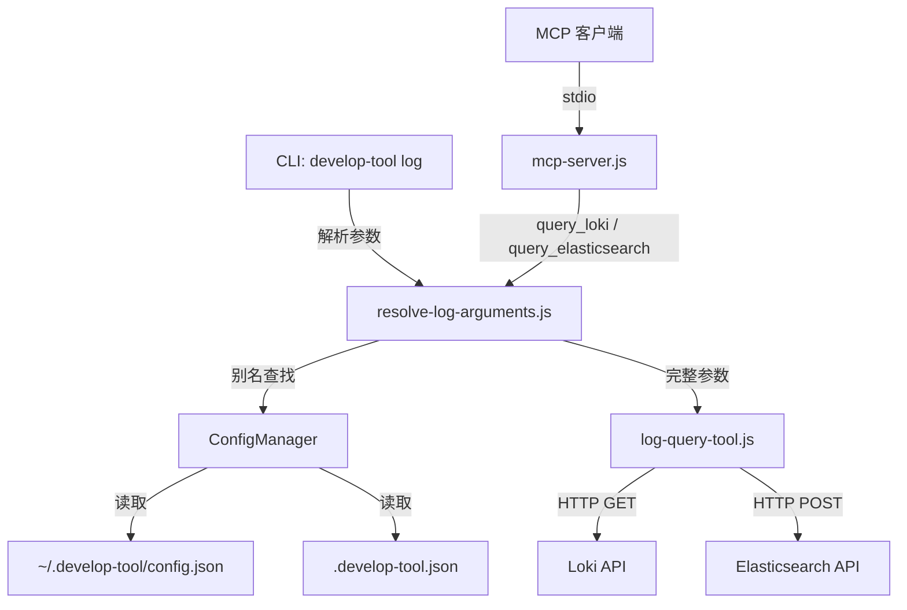
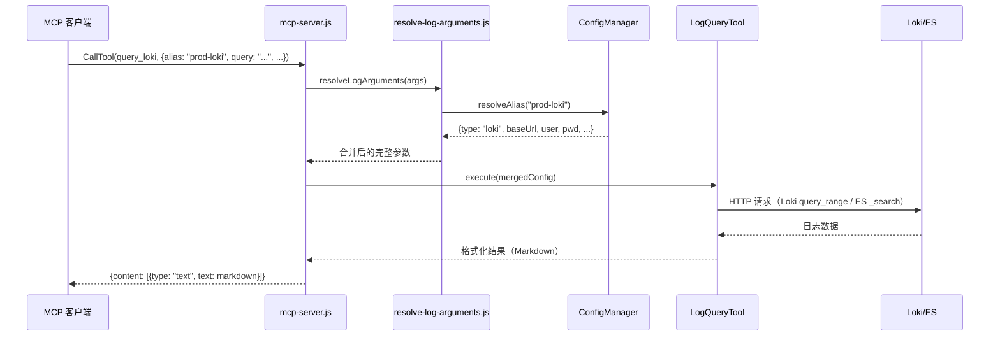
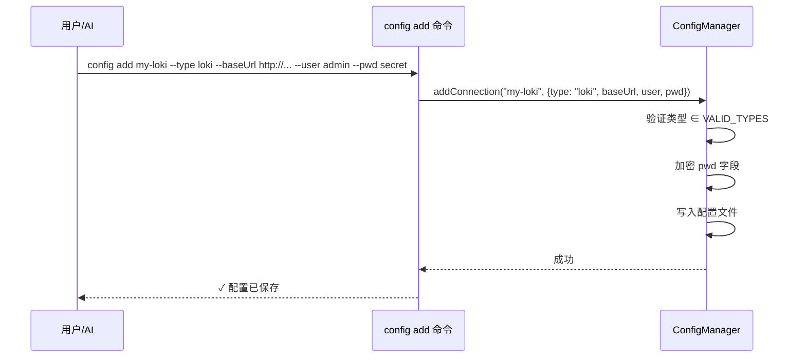
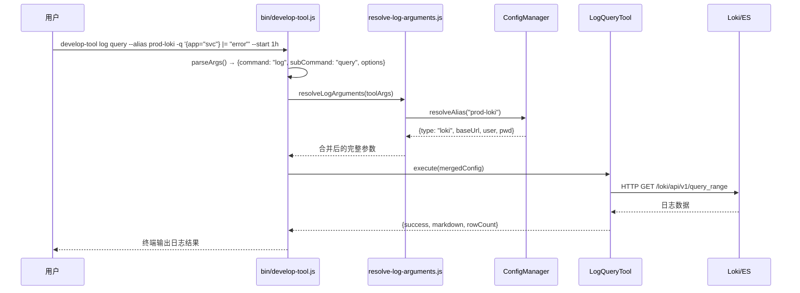

# 设计文档: 日志查询模块 (Log Query Module)

## 概述

日志查询模块为现有 MCP 开发工具服务新增多平台日志查询能力，支持 Loki 和 Elasticsearch 等主流日志平台。模块复用现有 ConfigManager 别名配置体系，用户通过 `config add` 添加日志平台连接信息（指定平台类型和连接参数），查询时通过别名即可快速检索日志。

本模块同时支持 **CLI 模式** 和 **MCP 模式** 两种调用方式：
- **CLI 模式**: 用户通过命令行 `develop-tool log query` 执行日志查询，结果直接输出到终端
- **MCP 模式**: AI 通过 MCP 协议调用 `query_loki` / `query_elasticsearch` 工具，结果以 Markdown 格式返回

本模块遵循只读模式原则，所有操作仅执行日志查询，不修改任何远端数据。结果格式化为 Markdown 方便 AI 阅读和分析。

## 架构



## 序列图

### 通过别名查询日志



### 添加日志平台配置



### CLI 模式查询日志



## 组件与接口

### 组件 1: LogQueryTool (lib/log-query-tool.js)

**职责**: 负责与各日志平台的 HTTP 通信、查询执行、元数据查询和结果格式化。

**接口**:
```javascript
class LogQueryTool {
  /**
   * 统一执行入口，根据 type 分发到对应平台的查询方法
   * @param {Object} config - 完整配置（含连接信息和查询参数）
   * @returns {Promise<Object>} 查询结果
   */
  async execute(config) {}

  /**
   * 执行 Loki 日志查询
   * @param {Object} config - {baseUrl, user, pwd, query, start, end, limit, direction}
   * @returns {Promise<Object>} 格式化后的结果
   */
  async executeLoki(config) {}

  /**
   * 执行 Elasticsearch 日志查询
   * @param {Object} config - {baseUrl, user, pwd, index, query, start, end, limit}
   * @returns {Promise<Object>} 格式化后的结果
   */
  async executeElasticsearch(config) {}

  /**
   * 查询日志平台元数据（标签、索引等）
   * AI 可通过此接口了解平台上可用的标签/索引信息，以自主构建更精确的查询条件
   * @param {Object} config - {type, baseUrl, user, pwd, metadataType, ...}
   * @returns {Promise<Object>} 元数据结果
   */
  async queryMetadata(config) {}

  /**
   * 查询 Loki 元数据（标签名、标签值、流信息）
   * @param {Object} config - {baseUrl, user, pwd, metadataType, label, start, end}
   * @returns {Promise<Object>} Loki 元数据
   */
  async queryLokiMetadata(config) {}

  /**
   * 查询 Elasticsearch 元数据（索引列表、字段映射）
   * @param {Object} config - {baseUrl, user, pwd, metadataType, index}
   * @returns {Promise<Object>} ES 元数据
   */
  async queryEsMetadata(config) {}

  /**
   * 将日志条目格式化为 Markdown
   * @param {Array} entries - 日志条目数组
   * @param {string} type - 日志平台类型
   * @returns {string} Markdown 格式的日志内容
   */
  formatAsMarkdown(entries, type) {}
}
```

### 组件 2: resolve-log-arguments.js (lib/resolve-log-arguments.js)

**职责**: 解析日志查询工具的调用参数，支持 alias 模式和直接参数模式，处理日志工具特有的参数映射。

**接口**:
```javascript
/**
 * 解析日志工具调用参数
 * @param {Object} args - 工具调用传入的参数
 * @param {string} [args.alias] - 日志平台连接别名
 * @param {string} [args.baseUrl] - 日志平台地址
 * @param {string} [args.user] - 用户名（可选，部分平台不需要认证）
 * @param {string} [args.pwd] - 密码/Token（可选）
 * @param {string} args.query - 查询表达式（LogQL / Query DSL JSON）
 * @param {string} [args.start] - 起始时间（ISO 8601 或相对时间如 "1h"）
 * @param {string} [args.end] - 结束时间（ISO 8601 或 "now"）
 * @param {number} [args.limit] - 返回行数限制
 * @param {Object} [configManagerOptions] - ConfigManager 构造选项
 * @returns {Object} 完整的日志查询配置
 */
function resolveLogArguments(args, configManagerOptions) {}
```

### 组件 3: ConfigManager 扩展

**变更**: 在 `VALID_TYPES` 中新增 `'loki'` 和 `'elasticsearch'` 类型，新增 `REQUIRED_LOG_FIELDS` 常量。

```javascript
// 新增日志平台类型
const VALID_LOG_TYPES = ['loki', 'elasticsearch'];

// 更新 VALID_TYPES
const VALID_TYPES = [...VALID_DB_TYPES, 'jenkins', ...VALID_LOG_TYPES];

// 日志平台连接配置必填字段（user/pwd 可选，支持无认证模式）
const REQUIRED_LOG_FIELDS = ['type', 'baseUrl'];
```

**resolveAlias 扩展**: 对日志类型返回 `{type, baseUrl, user, pwd}` 格式。

### 组件 4: MCP 工具注册 (mcp.full.config.js 扩展)

**新增工具**:
- `query_loki` - Loki 日志查询
- `query_elasticsearch` - Elasticsearch 日志查询
- `query_log_metadata` - 日志平台元数据查询（AI 用于发现标签、索引等信息以自主构建过滤条件）

**`query_log_metadata` 工具 inputSchema**:
```javascript
{
  type: "object",
  properties: {
    alias: { type: "string", description: "日志平台连接别名（可选，指定后其他连接参数可省略）" },
    baseUrl: { type: "string", description: "日志平台地址" },
    user: { type: "string", description: "认证用户名" },
    pwd: { type: "string", description: "认证密码/Token" },
    metadataType: {
      type: "string",
      description: "元数据类型。Loki: labels(标签列表), label_values(标签值), series(流信息)。ES: indices(索引列表), mappings(字段映射), field_caps(字段能力)",
      enum: ["labels", "label_values", "series", "indices", "mappings", "field_caps"]
    },
    label: { type: "string", description: "标签名（仅 label_values 类型需要）" },
    match: { type: "string", description: "流选择器（仅 series 类型需要，如 '{app=\"svc\"}'）" },
    index: { type: "string", description: "索引名/模式（ES mappings/field_caps 类型需要）" },
    start: { type: "string", description: "起始时间（可选，用于限制元数据的时间范围）" },
    end: { type: "string", description: "结束时间（可选）" }
  },
  required: ["metadataType"]
}
```

**AI 使用场景**: AI 在收到用户的日志查询请求时，可以先调用 `query_log_metadata` 获取可用的标签/索引信息，然后自主构建更精确的查询条件。例如：
1. 用户说"查一下生产环境最近的错误日志"
2. AI 先调 `query_log_metadata({alias: "prod-loki", metadataType: "labels"})` 获取可用标签
3. AI 再调 `query_log_metadata({alias: "prod-loki", metadataType: "label_values", label: "namespace"})` 查看有哪些 namespace
4. AI 根据元数据构建精确查询: `{namespace="production"} |= "error"`

### 组件 5: CLI 日志命令 (bin/develop-tool.js 扩展)

**职责**: 在 CLI 中提供 `log` 命令，支持终端直接执行日志查询和元数据查询。

**新增命令**:
```
develop-tool log query [选项]       执行日志查询
develop-tool log metadata [选项]    查询日志平台元数据（标签、索引等）
```

**CLI 选项**:
```
--alias <alias>         使用预配置的日志平台连接别名
--base-url <url>        日志平台地址（未指定 alias 时必填）
--user <user>           认证用户名（可选）
--password <pwd>        认证密码/Token（可选）
--password-stdin        从标准输入读取密码
-q, --query <expr>      查询表达式（LogQL / ES Query DSL）
--start <time>          起始时间（ISO 8601 或相对时间如 "1h", "30m", "7d"）
--end <time>            结束时间（默认 "now"）
--limit <n>             返回行数限制（默认 100）
--direction <dir>       排序方向: forward | backward（仅 Loki，默认 backward）
--index <pattern>       ES 索引模式（仅 Elasticsearch）
--type <type>           日志平台类型 (loki, elasticsearch)，使用 alias 时可省略
--metadata-type <type>  元数据类型 (labels, label_values, series, indices, mappings, field_caps)
--label <name>          标签名（配合 metadata-type=label_values 使用）
--match <selector>      流选择器（配合 metadata-type=series 使用）
```

**接口（内部函数）**:
```javascript
/**
 * 处理 log query 子命令
 * 解析 CLI 参数，调用 LogQueryTool 执行查询，格式化输出到终端
 * @param {Object} options - 解析后的 CLI 选项
 */
async function handleLogQuery(options) {}

/**
 * 处理 log metadata 子命令
 * 查询日志平台元数据（标签、索引等）
 * @param {Object} options - 解析后的 CLI 选项
 */
async function handleLogMetadata(options) {}

/**
 * 处理 log 命令分发
 * @param {string} subCommand - 子命令 (query, metadata)
 * @param {Object} options - CLI 选项
 */
async function handleLog(subCommand, options) {}
```

**输出格式**: CLI 模式直接将 Markdown 表格输出到终端（利用终端等宽字体的对齐特性），同时输出行数统计和可能的警告信息。

## 数据模型

### 日志平台配置结构

```javascript
// Loki 配置（存储于 config.json 中）
{
  "type": "loki",
  "baseUrl": "http://loki.example.com:3100",  // Loki 服务地址
  "user": "admin",                              // 可选，Basic Auth 用户名
  "pwd": "encrypted_password",                  // 可选，加密后的密码/Token
  "orgId": "1"                                  // 可选，Loki 租户 ID
}

// Elasticsearch 配置
{
  "type": "elasticsearch",
  "baseUrl": "https://es.example.com:9200",    // ES 集群地址
  "user": "elastic",                            // 可选，认证用户名
  "pwd": "encrypted_password",                  // 可选，加密后的密码/API Key
  "index": "app-logs-*"                         // 可选，默认查询的索引模式
}
```

**验证规则**:
- `type` 必须为 `'loki'` 或 `'elasticsearch'`
- `baseUrl` 必须非空且为有效 URL 格式
- `user` 和 `pwd` 可选（支持无认证的内网部署）
- 若提供 `pwd`，通过 crypto 模块加密存储

### 查询参数结构

```javascript
// Loki 查询参数
{
  query: '{app="myservice"} |= "error"',  // LogQL 表达式
  start: "2024-01-01T00:00:00Z",          // ISO 8601 或相对时间 "1h"（1小时前）
  end: "now",                              // ISO 8601 或 "now"
  limit: 100,                              // 返回行数限制，默认 100，最大 1000
  direction: "backward"                    // 排序方向: "forward" | "backward"
}

// Elasticsearch 查询参数
{
  index: "app-logs-*",                     // 目标索引（覆盖配置中的默认索引）
  query: '{"match": {"message": "error"}}', // Query DSL JSON 字符串
  start: "2024-01-01T00:00:00Z",           // 起始时间
  end: "now",                              // 结束时间
  limit: 100                               // 返回文档数，默认 100，最大 1000
}
```

### 查询结果结构

```javascript
{
  success: true,
  platform: "loki",                // 日志平台类型
  rowCount: 42,                    // 返回的日志条数
  markdown: "| 时间 | 标签 | 内容 |\n...",  // Markdown 格式化的日志
  warning: "⚠️ ...",               // 可选，行数超限警告
  truncated: false                 // 是否被截断
}
```

### 元数据查询参数结构

```javascript
// 元数据查询通用参数
{
  alias: "prod-loki",              // 连接别名（与直接参数二选一）
  metadataType: "labels",          // 元数据类型（见下方支持列表）
  // 以下为直接参数模式（无 alias 时使用）
  baseUrl: "http://loki:3100",
  user: "admin",
  pwd: "secret"
}

// Loki 支持的 metadataType:
// - "labels"       → 获取所有标签名列表（GET /loki/api/v1/labels）
// - "label_values" → 获取指定标签的所有值（GET /loki/api/v1/label/{label}/values）
//                    额外参数: label（标签名）、start/end（时间范围，可选）
// - "series"       → 获取匹配的日志流信息（GET /loki/api/v1/series）
//                    额外参数: match（流选择器，如 '{app="svc"}'）、start/end

// Elasticsearch 支持的 metadataType:
// - "indices"      → 获取索引列表（GET /_cat/indices?format=json）
// - "mappings"     → 获取指定索引的字段映射（GET /{index}/_mapping）
//                    额外参数: index（索引名/模式）
// - "field_caps"   → 获取字段能力信息（GET /{index}/_field_caps?fields=*）
//                    额外参数: index（索引名/模式，可选）
```

### 元数据查询结果结构

```javascript
{
  success: true,
  platform: "loki",
  metadataType: "labels",
  markdown: "## 可用标签\n\n- app\n- namespace\n- pod\n- ...",  // Markdown 格式化
  data: ["app", "namespace", "pod", "container", "job"]           // 原始数据（方便 AI 程序化处理）
}

// label_values 结果示例
{
  success: true,
  platform: "loki",
  metadataType: "label_values",
  label: "app",
  markdown: "## 标签 `app` 的可用值\n\n- payment-service\n- user-service\n- ...",
  data: ["payment-service", "user-service", "gateway", "auth-service"]
}

// ES indices 结果示例
{
  success: true,
  platform: "elasticsearch",
  metadataType: "indices",
  markdown: "| 索引名 | 文档数 | 大小 |\n|---|---|---|\n| app-logs-2024.01.15 | 125000 | 256mb |\n...",
  data: [{index: "app-logs-2024.01.15", docsCount: 125000, size: "256mb"}, ...]
}

// ES mappings 结果示例
{
  success: true,
  platform: "elasticsearch",
  metadataType: "mappings",
  index: "app-logs-*",
  markdown: "## 索引 `app-logs-*` 字段映射\n\n| 字段 | 类型 |\n|---|---|\n| @timestamp | date |\n| message | text |\n| level | keyword |\n...",
  data: {"@timestamp": "date", "message": "text", "level": "keyword", ...}
}
```


## 算法伪代码与形式化规格

### 函数 1: LogQueryTool.execute(config)

```javascript
async execute(config) {
  const { type } = config;
  switch (type) {
    case 'loki':
      return await this.executeLoki(config);
    case 'elasticsearch':
      return await this.executeElasticsearch(config);
    default:
      return { success: false, error: `不支持的日志平台类型: ${type}`, code: 'UNSUPPORTED_TYPE' };
  }
}
```

**前置条件:**
- `config` 非空且包含 `type` 字段
- `config.type` ∈ {'loki', 'elasticsearch'}
- `config.baseUrl` 非空
- `config.query` 非空

**后置条件:**
- 返回对象包含 `success` 布尔字段
- 若 `success === true`，结果包含 `markdown`、`rowCount`、`platform` 字段
- 若 `success === false`，结果包含 `error`、`code` 字段
- 不修改任何远端数据（只读）

### 函数 2: LogQueryTool.executeLoki(config)

```javascript
async executeLoki(config) {
  const { baseUrl, user, pwd, query, start, end, limit = 100, direction = 'backward', orgId } = config;

  // 1. 解析时间参数为纳秒时间戳（Loki API 要求）
  const startNs = this.parseTime(start);
  const endNs = this.parseTime(end || 'now');

  // 2. 限制返回行数
  const safeLimit = Math.min(Math.max(1, limit), MAX_LOG_LIMIT);

  // 3. 构建 Loki query_range API 请求
  const url = `${baseUrl}/loki/api/v1/query_range`;
  const params = { query, start: startNs, end: endNs, limit: safeLimit, direction };
  const headers = this.buildAuthHeaders(user, pwd, orgId);

  // 4. 执行 HTTP GET 请求
  const response = await this.httpGet(url, params, headers);

  // 5. 解析结果并格式化
  const entries = this.parseLokiResponse(response);
  return this.buildResult(entries, 'loki', safeLimit);
}
```

**前置条件:**
- `config.baseUrl` 是有效的 HTTP/HTTPS URL
- `config.query` 是有效的 LogQL 表达式
- `config.start` 可解析为时间（ISO 8601 或相对时间格式）
- `config.limit` 为正整数或 undefined

**后置条件:**
- HTTP 请求使用 GET 方法（只读）
- `limit` 值被限制在 [1, MAX_LOG_LIMIT] 范围内
- 返回结果中 `platform === 'loki'`
- 时间解析失败时抛出错误并返回失败结果

**循环不变量:** 无（单次 HTTP 请求）

### 函数 3: LogQueryTool.executeElasticsearch(config)

```javascript
async executeElasticsearch(config) {
  const { baseUrl, user, pwd, index, query, start, end, limit = 100 } = config;

  // 1. 限制返回行数
  const safeLimit = Math.min(Math.max(1, limit), MAX_LOG_LIMIT);

  // 2. 构建 ES 查询 DSL
  const searchBody = this.buildEsSearchBody(query, start, end, safeLimit);

  // 3. 构建请求 URL
  const targetIndex = index || '_all';
  const url = `${baseUrl}/${targetIndex}/_search`;
  const headers = this.buildAuthHeaders(user, pwd);

  // 4. 执行 HTTP POST 请求（ES _search 使用 POST）
  const response = await this.httpPost(url, searchBody, headers);

  // 5. 解析结果并格式化
  const entries = this.parseEsResponse(response);
  return this.buildResult(entries, 'elasticsearch', safeLimit);
}
```

**前置条件:**
- `config.baseUrl` 是有效的 HTTP/HTTPS URL
- `config.query` 是有效的 JSON 字符串（Query DSL）或简单搜索字符串
- `config.index` 为有效的 ES 索引名/模式或 undefined

**后置条件:**
- ES `_search` API 本身就是只读操作
- `limit` 值被限制在 [1, MAX_LOG_LIMIT] 范围内
- 返回结果中 `platform === 'elasticsearch'`
- JSON 解析失败时返回友好错误信息

**循环不变量:** 无（单次 HTTP 请求）

### 函数 4: resolveLogArguments(args)

```javascript
function resolveLogArguments(args, configManagerOptions) {
  const { alias, baseUrl, user, pwd, ...queryParams } = args;

  // 情况1: 未传 alias，使用直接参数
  if (!alias) {
    if (!baseUrl) {
      throw new Error('缺少必填参数: baseUrl（未指定 alias 时需要提供日志平台地址，或使用 alias 指定预配置的连接别名）');
    }
    return { baseUrl, user, pwd, ...queryParams };
  }

  // 情况2: 传入 alias，从配置解析
  const ConfigManager = require('./config-manager');
  const configManager = new ConfigManager(configManagerOptions);
  const aliasConfig = configManager.resolveAlias(alias);

  // 直接参数覆盖 alias 配置
  const merged = {
    type: aliasConfig.type,
    baseUrl: (baseUrl || aliasConfig.baseUrl),
    user: (user || aliasConfig.user),
    pwd: (pwd || aliasConfig.pwd),
    ...queryParams
  };

  // 合并别名配置中的额外字段（如 orgId、index）
  if (aliasConfig.orgId && !merged.orgId) merged.orgId = aliasConfig.orgId;
  if (aliasConfig.index && !merged.index) merged.index = aliasConfig.index;

  return merged;
}
```

**前置条件:**
- `args` 非空对象
- 若无 `alias`，则 `baseUrl` 必须提供
- 若有 `alias`，则 alias 必须在 ConfigManager 中存在

**后置条件:**
- 返回对象必须包含 `baseUrl` 字段
- 直接参数优先级高于别名配置
- `query` 字段原样传递不做修改

### 函数 5: LogQueryTool.parseTime(timeStr)

```javascript
/**
 * 解析时间字符串为 Loki 纳秒时间戳或 ES ISO 格式
 * 支持格式:
 * - "now" → 当前时间
 * - "5m", "1h", "24h", "7d" → 相对时间（当前时间减去对应时长）
 * - ISO 8601 → 直接解析
 */
parseTime(timeStr) {
  if (!timeStr || timeStr === 'now') {
    return Date.now() * 1000000; // 纳秒
  }

  // 相对时间格式: 数字 + 单位(m/h/d)
  const relativeMatch = timeStr.match(/^(\d+)(m|h|d)$/);
  if (relativeMatch) {
    const value = parseInt(relativeMatch[1]);
    const unit = relativeMatch[2];
    const msMap = { m: 60000, h: 3600000, d: 86400000 };
    const offsetMs = value * msMap[unit];
    return (Date.now() - offsetMs) * 1000000;
  }

  // ISO 8601 格式
  const parsed = new Date(timeStr);
  if (isNaN(parsed.getTime())) {
    throw new Error(`无效的时间格式: "${timeStr}"。支持格式: ISO 8601、"now"、相对时间(如 "1h", "30m", "7d")`);
  }
  return parsed.getTime() * 1000000;
}
```

**前置条件:**
- `timeStr` 为 string 类型或 null/undefined
- 若为相对时间，格式必须为 `\d+(m|h|d)`

**后置条件:**
- 返回值为正整数（纳秒时间戳）
- "now" 或 null 返回当前时间
- 无效格式抛出包含可用格式说明的错误

### 函数 6: handleLogQuery(options) — CLI 入口

```javascript
async function handleLogQuery(options) {
  const LogQueryTool = require('../lib/log-query-tool.js');
  const { resolveLogArguments } = require('../lib/resolve-log-arguments.js');

  // 1. 从 CLI 选项构造工具参数对象
  const toolArgs = {};
  if (options.alias) toolArgs.alias = options.alias;
  if (options.baseUrl) toolArgs.baseUrl = options.baseUrl;
  if (options.user) toolArgs.user = options.user;
  if (options.password) toolArgs.pwd = options.password;
  if (options.query) toolArgs.query = options.query;
  if (options.start) toolArgs.start = options.start;
  if (options.end) toolArgs.end = options.end;
  if (options.limit) toolArgs.limit = parseInt(options.limit);
  if (options.direction) toolArgs.direction = options.direction;
  if (options.index) toolArgs.index = options.index;
  if (options.type) toolArgs.type = options.type;

  // 2. 验证必填的查询表达式
  if (!toolArgs.query) {
    console.error('错误: 请指定查询表达式 (-q 或 --query)');
    process.exit(1);
  }

  // 3. 解析连接参数（支持 alias 和直接参数）
  const resolvedArgs = resolveLogArguments(toolArgs);

  // 4. 执行查询
  const logTool = new LogQueryTool();
  const result = await logTool.execute(resolvedArgs);

  // 5. 输出结果
  if (result.success) {
    if (result.warning) console.warn(result.warning);
    console.log(result.markdown);
    console.log(`\n共 ${result.rowCount} 条日志`);
  } else {
    console.error(`查询失败: ${result.error}`);
    process.exit(1);
  }
}
```

**前置条件:**
- `options.query` 或 `options.alias` 至少提供其一（query 为必填）
- 若无 `options.alias`，则需提供 `options.baseUrl` 和 `options.type`

**后置条件:**
- 成功时输出 Markdown 格式日志到 stdout
- 失败时输出错误信息到 stderr 并 exit(1)

### 函数 7: LogQueryTool.queryMetadata(config) — 元数据查询

```javascript
async queryMetadata(config) {
  const { type, metadataType } = config;

  // 验证 metadataType 是否合法
  const validTypes = {
    loki: ['labels', 'label_values', 'series'],
    elasticsearch: ['indices', 'mappings', 'field_caps']
  };

  if (!validTypes[type] || !validTypes[type].includes(metadataType)) {
    return {
      success: false,
      error: `不支持的元数据类型: "${metadataType}"（${type} 支持: ${(validTypes[type] || []).join(', ')}）`,
      code: 'INVALID_METADATA_TYPE'
    };
  }

  switch (type) {
    case 'loki':
      return await this.queryLokiMetadata(config);
    case 'elasticsearch':
      return await this.queryEsMetadata(config);
    default:
      return { success: false, error: `不支持的日志平台类型: ${type}`, code: 'UNSUPPORTED_TYPE' };
  }
}
```

**前置条件:**
- `config.type` ∈ {'loki', 'elasticsearch'}
- `config.metadataType` 为对应平台支持的元数据类型
- `config.baseUrl` 非空

**后置条件:**
- 返回对象包含 `success`、`platform`、`metadataType` 字段
- 若成功，包含 `markdown`（格式化展示）和 `data`（原始数据，供 AI 程序化处理）
- 所有请求均为只读 GET 操作

### 函数 8: LogQueryTool.queryLokiMetadata(config)

```javascript
async queryLokiMetadata(config) {
  const { baseUrl, user, pwd, orgId, metadataType, label, match, start, end } = config;
  const headers = this.buildAuthHeaders(user, pwd, orgId);

  let url, params;
  switch (metadataType) {
    case 'labels':
      // GET /loki/api/v1/labels
      url = `${baseUrl}/loki/api/v1/labels`;
      params = {};
      if (start) params.start = this.parseTime(start);
      if (end) params.end = this.parseTime(end);
      break;

    case 'label_values':
      // GET /loki/api/v1/label/{label}/values
      if (!label) throw new Error('查询标签值时需要指定 label 参数');
      url = `${baseUrl}/loki/api/v1/label/${encodeURIComponent(label)}/values`;
      params = {};
      if (start) params.start = this.parseTime(start);
      if (end) params.end = this.parseTime(end);
      break;

    case 'series':
      // GET /loki/api/v1/series
      if (!match) throw new Error('查询 series 时需要指定 match 参数（流选择器）');
      url = `${baseUrl}/loki/api/v1/series`;
      params = { match: match };
      if (start) params.start = this.parseTime(start);
      if (end) params.end = this.parseTime(end);
      break;
  }

  const response = await this.httpGet(url, params, headers);
  const data = response.data || [];
  const markdown = this.formatMetadataAsMarkdown(data, 'loki', metadataType, { label });

  return { success: true, platform: 'loki', metadataType, data, markdown, label };
}
```

### 函数 9: LogQueryTool.queryEsMetadata(config)

```javascript
async queryEsMetadata(config) {
  const { baseUrl, user, pwd, metadataType, index } = config;
  const headers = this.buildAuthHeaders(user, pwd);

  let url, response, data, markdown;
  switch (metadataType) {
    case 'indices':
      // GET /_cat/indices?format=json
      url = `${baseUrl}/_cat/indices`;
      response = await this.httpGet(url, { format: 'json', h: 'index,docs.count,store.size' }, headers);
      data = response;
      markdown = this.formatMetadataAsMarkdown(data, 'elasticsearch', 'indices');
      break;

    case 'mappings':
      // GET /{index}/_mapping
      if (!index) throw new Error('查询字段映射时需要指定 index 参数');
      url = `${baseUrl}/${encodeURIComponent(index)}/_mapping`;
      response = await this.httpGet(url, {}, headers);
      data = this.flattenEsMappings(response);
      markdown = this.formatMetadataAsMarkdown(data, 'elasticsearch', 'mappings', { index });
      break;

    case 'field_caps':
      // GET /{index}/_field_caps?fields=*
      const targetIndex = index || '_all';
      url = `${baseUrl}/${encodeURIComponent(targetIndex)}/_field_caps`;
      response = await this.httpGet(url, { fields: '*' }, headers);
      data = this.flattenFieldCaps(response);
      markdown = this.formatMetadataAsMarkdown(data, 'elasticsearch', 'field_caps', { index: targetIndex });
      break;
  }

  return { success: true, platform: 'elasticsearch', metadataType, data, markdown, index };
}
```

**前置条件 (函数 8 & 9):**
- `config.baseUrl` 有效
- `label` 参数在 `label_values` 类型时必填
- `match` 参数在 `series` 类型时必填
- `index` 参数在 `mappings` 类型时必填

**后置条件:**
- 所有请求均为 GET（只读）
- 返回 `data` 字段为结构化数据，AI 可直接解析
- 返回 `markdown` 字段为人类可读的格式化展示

## 示例用法

### MCP 模式示例

```javascript
// 示例 1: 通过别名查询 Loki 日志
const result = await logTool.execute({
  type: 'loki',
  baseUrl: 'http://loki:3100',
  query: '{app="payment-service"} |= "error"',
  start: '1h',
  end: 'now',
  limit: 50
});
// result.markdown → "| 时间 | 标签 | 日志内容 |\n|---|---|---|\n| 2024-01-15 10:23:01 | app=payment-service | Error: timeout |\n..."

// 示例 2: 通过别名查询 Elasticsearch
const result = await logTool.execute({
  type: 'elasticsearch',
  baseUrl: 'https://es:9200',
  index: 'app-logs-2024.01.*',
  query: '{"match": {"level": "ERROR"}}',
  start: '24h',
  limit: 100
});

// 示例 3: MCP 客户端调用（别名模式）
// 用户先配置: config add prod-loki --type loki --baseUrl http://loki.prod:3100 --user admin --pwd secret
// 然后查询只需:
// CallTool("query_loki", {alias: "prod-loki", query: '{namespace="production"} |= "panic"', start: "30m"})

// 示例 4: 直接参数模式（无需预配置）
// CallTool("query_elasticsearch", {baseUrl: "http://localhost:9200", index: "logs-*", query: '{"match_all": {}}', limit: 10})
```

### CLI 模式示例

```bash
# 添加 Loki 日志平台配置
develop-tool config add prod-loki --type loki --base-url http://loki.prod:3100 --user admin --password secret

# 添加 Elasticsearch 配置
develop-tool config add prod-es --type elasticsearch --base-url https://es.prod:9200 --user elastic --password-stdin

# 通过别名查询 Loki 日志（最常用方式）
develop-tool log query --alias prod-loki -q '{app="payment-service"} |= "error"' --start 1h

# 通过别名查询 ES 日志
develop-tool log query --alias prod-es -q '{"match": {"level": "ERROR"}}' --index app-logs-* --start 24h --limit 50

# 直接参数模式（无需预配置）
develop-tool log query --type loki --base-url http://localhost:3100 -q '{job="api"}' --start 30m

# 指定时间范围和排序
develop-tool log query --alias prod-loki -q '{namespace="production"}' --start 2024-01-15T00:00:00Z --end 2024-01-15T12:00:00Z --direction forward --limit 200

# 查询元数据 - 获取 Loki 所有标签
develop-tool log metadata --alias prod-loki --metadata-type labels

# 查询元数据 - 获取指定标签的所有值
develop-tool log metadata --alias prod-loki --metadata-type label_values --label app

# 查询元数据 - 获取 ES 索引列表
develop-tool log metadata --alias prod-es --metadata-type indices

# 查询元数据 - 获取 ES 字段映射
develop-tool log metadata --alias prod-es --metadata-type mappings --index app-logs-*
```

### AI 自主元数据查询流程示例

```javascript
// AI 收到用户请求: "帮我查一下生产环境最近有什么错误"
// AI 不确定具体的标签值，于是先查元数据:

// 第1步: 查询可用标签
const labels = await logTool.queryMetadata({
  type: 'loki', baseUrl: 'http://loki:3100',
  metadataType: 'labels'
});
// labels.data → ["app", "namespace", "pod", "level", "job"]

// 第2步: 查看 namespace 有哪些值
const namespaces = await logTool.queryMetadata({
  type: 'loki', baseUrl: 'http://loki:3100',
  metadataType: 'label_values', label: 'namespace'
});
// namespaces.data → ["production", "staging", "development"]

// 第3步: 查看 production 下有哪些应用
const series = await logTool.queryMetadata({
  type: 'loki', baseUrl: 'http://loki:3100',
  metadataType: 'series', match: '{namespace="production"}'
});
// series.data → [{app: "payment", namespace: "production"}, {app: "gateway", ...}]

// 第4步: AI 根据元数据构建精确查询
const result = await logTool.execute({
  type: 'loki', baseUrl: 'http://loki:3100',
  query: '{namespace="production"} |= "error" | level="ERROR"',
  start: '1h', limit: 50
});
```

## 正确性属性

*属性是系统在所有有效执行中应保持为真的特征或行为——本质上是关于系统应做什么的形式化陈述。属性作为人类可读规格与机器可验证正确性保证之间的桥梁。*

### Property 1: 日志配置保存/解析往返一致性

*For any* 有效的日志平台配置（type ∈ {loki, elasticsearch}，baseUrl 非空），通过 ConfigManager 保存后再通过 resolveAlias 解析，应返回等价的配置对象（type、baseUrl、user 一致，pwd 解密后一致）。

**Validates: Requirements 1.1, 1.4, 1.5, 4.1**

### Property 2: 缺少必填字段时拒绝添加

*For any* 日志平台配置对象，若缺少 `type` 或 `baseUrl` 字段，ConfigManager.addConnection 应抛出错误并在错误信息中列出缺少的字段名称。

**Validates: Requirement 1.2**

### Property 3: 密码不以明文存储

*For any* 包含 pwd 字段的日志平台配置，保存后配置文件中 pwd 字段的值不包含原始明文密码。

**Validates: Requirement 1.3**

### Property 4: 行数限制钳位

*For any* 正整数 limit 值，经过 `Math.min(Math.max(1, limit), MAX_LOG_LIMIT)` 处理后的结果应在 [1, 1000] 范围内。

**Validates: Requirements 2.4, 3.4**

### Property 5: 直接参数覆盖别名配置

*For any* 已存在的别名配置和任意直接参数（如 baseUrl），resolveLogArguments 返回的对应字段值应等于直接参数的值，而非别名配置中的值。

**Validates: Requirement 4.2**

### Property 6: 查询参数原样传递

*For any* 输入参数中的 query、start、end、limit 字段，resolveLogArguments 输出中这些字段的值应与输入完全一致。

**Validates: Requirements 4.4, 4.5**

### Property 7: 相对时间解析产生有效纳秒时间戳

*For any* 有效的相对时间字符串（格式 `\d+(m|h|d)`），parseTime 应返回一个正整数，且该值小于当前时间的纳秒表示，大于 0。

**Validates: Requirements 2.2, 8.2**

### Property 8: ISO 8601 时间解析往返

*For any* 有效的 Date 对象，将其转为 ISO 8601 字符串后经 parseTime 解析，结果应等于 `date.getTime() * 1000000`。

**Validates: Requirement 8.3**

### Property 9: 无效时间格式抛出错误

*For any* 不符合支持格式（ISO 8601、相对时间、"now"）的字符串，parseTime 应抛出包含支持格式说明的错误。

**Validates: Requirement 8.4**

### Property 10: Markdown 格式化包含所有日志条目内容

*For any* 非空日志条目数组，formatAsMarkdown 的输出应包含每个条目的核心内容（日志消息文本）。

**Validates: Requirements 2.5, 3.5, 9.1, 9.2**

### Property 11: 成功结果结构不变量

*For any* 成功的查询或元数据查询结果（success === true），返回对象必须包含 platform、markdown 字段；日志查询还必须包含 rowCount 字段；元数据查询还必须包含 data 字段。

**Validates: Requirements 5.8, 9.4**

### Property 12: 达到 limit 上限时附加截断警告

*For any* 查询结果，若 rowCount 等于请求的 limit 值，结果中应包含 warning 或 truncated 标记。

**Validates: Requirement 9.3**

### Property 13: 无效元数据类型返回描述性错误

*For any* 不属于对应平台支持列表的 metadataType 字符串，queryMetadata 应返回 success === false 且错误信息中列出该平台支持的元数据类型。

**Validates: Requirement 5.7**

### Property 14: Loki 和元数据查询仅使用 GET 方法

*For any* Loki 日志查询或任何平台的元数据查询，所发出的 HTTP 请求方法应为 GET。

**Validates: Requirements 11.1, 11.3**

### Property 15: Elasticsearch 查询使用 POST _search

*For any* Elasticsearch 日志查询，所发出的 HTTP 请求应为 POST 方法且路径以 `/_search` 结尾。

**Validates: Requirement 11.2**

## 错误处理

### 错误场景 1: 日志平台连接失败

**条件**: 网络不可达、URL 无效、服务未启动
**响应**: 返回 `{success: false, error: "无法连接日志平台: <url>，请检查网络和服务状态", code: "CONNECTION_ERROR"}`
**恢复**: 用户检查 baseUrl 配置和网络连通性

### 错误场景 2: 认证失败

**条件**: 用户名/密码错误、Token 过期
**响应**: 返回 `{success: false, error: "认证失败 (HTTP 401/403)，请检查用户名和密码/Token", code: "AUTH_ERROR"}`
**恢复**: 用户更新配置中的认证信息

### 错误场景 3: 查询表达式语法错误

**条件**: LogQL 语法错误、ES Query DSL JSON 格式无效
**响应**: 返回 `{success: false, error: "查询表达式语法错误: <平台返回的错误信息>", code: "QUERY_SYNTAX_ERROR"}`
**恢复**: 用户修正查询表达式

### 错误场景 4: 超时

**条件**: 查询数据量过大导致响应超时
**响应**: 返回 `{success: false, error: "查询超时（${QUERY_TIMEOUT}ms），请缩小时间范围或添加更精确的过滤条件", code: "TIMEOUT"}`
**恢复**: 用户缩小时间范围或优化查询条件

### 错误场景 5: 索引/标签不存在

**条件**: ES 中指定索引不存在，Loki 中流选择器无匹配
**响应**: 返回 `{success: false, error: "未找到匹配的日志流/索引: <详情>", code: "NOT_FOUND"}`
**恢复**: 用户检查索引名称或标签选择器

## 测试策略

### 单元测试

- `resolve-log-arguments.js`: 测试别名解析、直接参数模式、参数覆盖、缺少参数报错
- `LogQueryTool.parseTime()`: 测试 ISO 8601、相对时间、"now"、无效格式
- `LogQueryTool.formatAsMarkdown()`: 测试 Loki/ES 两种格式的日志渲染
- `LogQueryTool.buildEsSearchBody()`: 测试查询 DSL 构建、时间范围过滤
- `LogQueryTool.queryMetadata()`: 测试各元数据类型的请求构建和响应解析
- `LogQueryTool.queryLokiMetadata()`: 测试 labels/label_values/series 三种元数据查询
- `LogQueryTool.queryEsMetadata()`: 测试 indices/mappings/field_caps 三种元数据查询
- `ConfigManager`: 测试新增 loki/elasticsearch 类型的配置添加和解析
- `handleLogQuery`: 测试 CLI 参数到工具参数的映射、缺少 query 参数报错
- `handleLogMetadata`: 测试 CLI 元数据查询参数映射、缺少 metadata-type 参数报错

### 属性测试 (Property-Based Testing)

**测试库**: fast-check

- 时间解析属性: 任意有效时间字符串经 parseTime 后返回正整数纳秒时间戳
- 行数限制属性: 任意 limit 值经 `Math.min(Math.max(1, limit), MAX_LOG_LIMIT)` 后结果在 [1, 1000]
- 参数合并属性: alias 配置与直接参数合并后，直接参数字段总是优先

### 集成测试

- Mock Loki HTTP API 验证完整查询流程
- Mock Elasticsearch HTTP API 验证完整查询流程
- 验证配置文件 → 别名解析 → 查询执行的端到端流程
- CLI 模式端到端: 模拟命令行参数 → 验证输出格式正确

## 性能考虑

- **查询超时**: 默认 30 秒超时，避免大范围查询阻塞 MCP 服务
- **结果限制**: 最大返回 1000 条日志，超出部分截断并提示用户缩小范围
- **无连接池**: 每次查询独立 HTTP 请求，适合 MCP 低频调用场景
- **流式响应**: 暂不支持，所有结果一次性返回。未来可考虑 Loki 的 tail WebSocket API

## 安全考虑

- **密码加密**: 配置中的 pwd/Token 通过现有 crypto 模块加密存储
- **只读模式**: 仅使用查询 API（Loki GET query_range, ES POST _search），不暴露任何写入接口
- **HTTPS 支持**: baseUrl 支持 https:// 协议，生产环境建议使用 TLS
- **无日志泄露**: 查询结果中不回显连接凭证信息
- **输入验证**: 对 baseUrl 进行基本 URL 格式验证，防止 SSRF 风险

## 依赖

| 依赖 | 用途 | 说明 |
|------|------|------|
| Node.js 内置 `http`/`https` | HTTP 请求 | 无需额外安装，使用原生模块减少依赖 |
| 现有 `lib/config-manager.js` | 别名配置管理 | 复用现有体系，仅扩展类型 |
| 现有 `lib/crypto.js` | 密码加密/解密 | 复用现有加密模块 |
